# UniHealth Database Relationship Diagram

## Entity Relationship Overview

```mermaid
erDiagram
    %% Core Entities
    Users {
        int id PK
        string name
        string email
        string password
        string role
        string patient_id FK
        timestamp email_verified_at
        timestamp created_at
        timestamp updated_at
    }

    Patients {
        string patient_id PK
        string philhealth_id
        string pwd_id
        string senior_citizen_id
        string last_name
        string first_name
        string middle_name
        string suffix
        string maiden_name
        string nickname
        date date_of_birth
        string place_of_birth
        string gender
        string civil_status
        string nationality
        string religion
        string mobile_number
        string landline_number
        string email
        string house_number
        string street
        string barangay
        string municipality_city
        string province
        string region
        string postal_code
        string emergency_contact_name
        string emergency_contact_relationship
        string emergency_contact_number
        string emergency_contact_address
        int created_by
        int updated_by
        boolean is_active
        boolean data_privacy_consent
        timestamp created_at
    }

    HealthcareFacilities {
        string facility_id PK
        string facility_code
        string facility_name
        string facility_type
        string facility_level
        string doh_license_number
        string philhealth_accreditation
        string facility_ownership
        string address
        string barangay
        string municipality_city
        string province
        string region
        string phone_number
        string email
        string website
        int bed_capacity
        string services_offered
        string operating_hours
        boolean emergency_services
        timestamp created_at
        timestamp updated_at
        boolean is_active
    }

    Medications {
        string medication_id PK
        string generic_name
        string brand_names
        string strength
        string dosage_form
        string drug_class
        boolean controlled_substance
        string fda_registration
        timestamp created_at
    }

    %% Medical Encounter Related
    MedicalEncounters {
        string encounter_id PK
        string patient_id FK
        string facility_id FK
        string encounter_type
        string encounter_class
        string chief_complaint
        string intervention
        date encounter_date
        time encounter_time
        date admission_date
        date discharge_date
        string encounter_status
        int created_by
        timestamp created_at
        timestamp updated_at
    }

    PatientPrescriptions {
        string prescription_id PK
        string patient_id FK
        string encounter_id FK
        string medication_id FK
        string dosage
        string frequency
        string route
        string duration
        int quantity_prescribed
        int refills_allowed
        string special_instructions
        string indication
        date prescription_date
        date start_date
        date end_date
        string prescription_status
        timestamp created_at
    }

    VitalSigns {
        string vital_sign_id PK
        string patient_id FK
        string encounter_id FK
        int recorded_by
        date measurement_date
        time measurement_time
        int systolic_bp
        int diastolic_bp
        int heart_rate
        int respiratory_rate
        decimal temperature
        int oxygen_saturation
        decimal weight
        decimal height
        decimal bmi
        int pain_score
        string pain_location
        string general_appearance
        string mental_status
        string bp_cuff_size
        string thermometer_type
        timestamp created_at
    }

    EncounterAttachments {
        string attachment_id PK
        string encounter_id FK
        string label
        string file_path
        timestamp created_at
        timestamp updated_at
    }

    %% Inventory Management
    FacilityMedicationInventory {
        string inventory_id PK
        string facility_id FK
        string medication_id FK
        int current_stock
        int minimum_stock_level
        int maximum_stock_level
        int reorder_point
        string lot_number
        date expiration_date
        string manufacturer_batch
        decimal unit_cost
        decimal total_value
        string storage_location
        string storage_conditions
        decimal storage_temperature_min
        decimal storage_temperature_max
        string supplier
        string purchase_order_number
        date received_date
        int received_by
        string stock_status
        date last_count_date
        int last_counted_by
        boolean expiry_alert_sent
        boolean low_stock_alert_sent
        timestamp created_at
        timestamp updated_at
    }

    InventoryTransaction {
        int id PK
        string inventory_id FK
        string transaction_type
        int quantity
        int previous_stock
        int new_stock
        string reference
        string remarks
        int performed_by FK
        timestamp created_at
        timestamp updated_at
    }

    %% Medication Request System
    MedicationRequest {
        int id PK
        string patient_id FK
        string prescription_file
        string status
        int reviewer_id FK
        string rejection_reason
        timestamp created_at
        timestamp updated_at
    }

    MedicationRequestItem {
        int id PK
        int medication_request_id FK
        string medication_id FK
        int quantity
        timestamp created_at
        timestamp updated_at
    }

    %% Notifications
    Notification {
        int id PK
        int user_id
        string role
        boolean is_global
        string type
        string title
        string message
        string action_url
        timestamp created_at
        timestamp updated_at
    }

    %% Patient Invitations
    PatientInvitation {
        int id PK
        string token
        int created_by
        timestamp expires_at
        timestamp used_at
        timestamp created_at
        timestamp updated_at
    }

    %% Relationships
    Users ||--o{ Patients : "can be linked to"
    Users ||--o{ Notification : "receives via notification_user"
    Users ||--o{ InventoryTransaction : "performs"
    
    Patients ||--o{ MedicalEncounters : "has"
    Patients ||--o{ PatientPrescriptions : "has"
    Patients ||--o{ VitalSigns : "has"
    Patients ||--o{ MedicationRequest : "makes"
    
    HealthcareFacilities ||--o{ MedicalEncounters : "hosts"
    HealthcareFacilities ||--o{ FacilityMedicationInventory : "owns"
    
    Medications ||--o{ PatientPrescriptions : "prescribed in"
    Medications ||--o{ FacilityMedicationInventory : "stored in"
    Medications ||--o{ MedicationRequestItem : "requested as"
    
    MedicalEncounters ||--o{ PatientPrescriptions : "generates"
    MedicalEncounters ||--o{ VitalSigns : "recorded during"
    MedicalEncounters ||--o{ EncounterAttachments : "has"
    MedicalEncounters }o--|| Patients : "belongs to"
    MedicalEncounters }o--|| HealthcareFacilities : "belongs to"
    
    PatientPrescriptions }o--|| Patients : "belongs to"
    PatientPrescriptions }o--|| MedicalEncounters : "belongs to"
    PatientPrescriptions }o--|| Medications : "belongs to"
    
    VitalSigns }o--|| Patients : "belongs to"
    VitalSigns }o--|| MedicalEncounters : "belongs to"
    
    EncounterAttachments }o--|| MedicalEncounters : "belongs to"
    
    FacilityMedicationInventory ||--o{ InventoryTransaction : "tracks"
    FacilityMedicationInventory }o--|| Medications : "belongs to"
    FacilityMedicationInventory }o--|| HealthcareFacilities : "belongs to"
    
    InventoryTransaction }o--|| FacilityMedicationInventory : "belongs to"
    InventoryTransaction }o--|| Users : "performed by"
    
    MedicationRequest ||--o{ MedicationRequestItem : "contains"
    MedicationRequest }o--|| Patients : "belongs to"
    MedicationRequest }o--|| Users : "reviewed by"
    
    MedicationRequestItem }o--|| MedicationRequest : "belongs to"
    MedicationRequestItem }o--|| Medications : "belongs to"
    
    Notification ||--o{ Users : "viewed by (many-to-many)"
```

## Relationship Summary

### Core User Management
- **Users** can be linked to **Patients** (optional one-to-one)
- **Users** have roles: administrator, intake-staff, health-staff, inventory-staff, patient
- **Users** receive **Notifications** through many-to-many relationship

### Patient Management
- **Patients** have multiple **MedicalEncounters**
- **Patients** have multiple **PatientPrescriptions**
- **Patients** have multiple **VitalSigns** records
- **Patients** can make **MedicationRequests**

### Healthcare Facilities
- **HealthcareFacilities** host multiple **MedicalEncounters**
- **HealthcareFacilities** manage **FacilityMedicationInventory**

### Medical Encounters
- **MedicalEncounters** belong to one **Patient** and one **HealthcareFacility**
- **MedicalEncounters** generate **PatientPrescriptions**
- **MedicalEncounters** have **VitalSigns** and **EncounterAttachments**

### Medications & Prescriptions
- **Medications** are prescribed in **PatientPrescriptions**
- **Medications** are stored in **FacilityMedicationInventory**
- **PatientPrescriptions** link **Patients**, **MedicalEncounters**, and **Medications**

### Inventory Management
- **FacilityMedicationInventory** tracks stock levels for specific **Medications** at **HealthcareFacilities**
- **InventoryTransaction** records all stock movements
- Low stock events trigger notifications

### Medication Request System
- **Patients** submit **MedicationRequests**
- **MedicationRequests** contain multiple **MedicationRequestItems**
- **MedicationRequestItems** reference specific **Medications**

### Supporting Features
- **Notifications** system for user alerts
- **PatientInvitation** system for patient registration
- **EncounterAttachments** for file storage

## Key Constraints & Features

1. **UUID Primary Keys**: Most entities use UUID primary keys for security and scalability
2. **Audit Trail**: Most models implement auditing for change tracking
3. **Soft Relationships**: Optional relationships where applicable (e.g., Users to Patients)
4. **Inventory Tracking**: Comprehensive stock management with transaction history
5. **Multi-tenant**: Facility-based data isolation
6. **Role-based Access**: User roles determine system access levels
